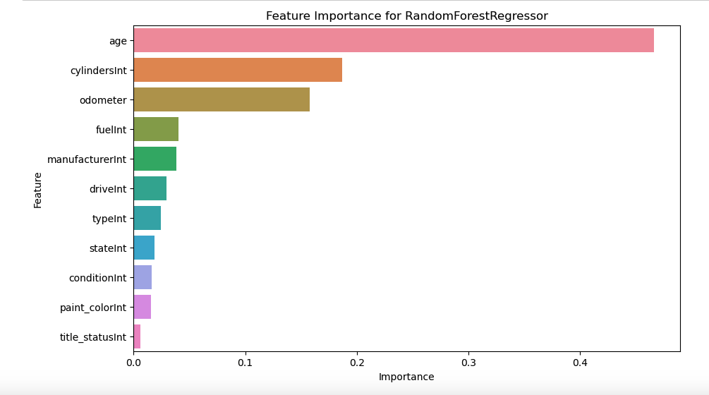

#  What drives the price of a car?

## Overview
This used car dataset has been retrieved from Kaggle. The original dataset had over 3 million entries. 
For the sake of processing, only 426k entries were selected. 
The goal is determining what factors make a car more or less expensive. 

I am following the CRISP-DM Framework for this analysis. 
Here is the link for Jupiter notebook https://github.com/paloorkar1689/UsedCarFeatureImportance/blob/main/car_price.ipynb

### 1 - Business Understanding
    1.1 - Data problem definition
        The goal of this problem is to develop a predictive model that will correctly predict the prices of used cars based on various features
        such as Odometer readings, Size, make/model and so on. We would need to employ various Regression models to identify patterns, 
        and important features that contribute to the price determination based on historical data and accurately predict any future car sale prices.
        In summary, the objective is to create a robust predictive model that accurately predicts the prices of used cars
        and identified the most significant factors contributing to their valuation.

### 2 - Data Understanding
    2.1 Data Collection
        -   Vehicle.csv dataset is present in the data folder.
        -   Data will be loaded with pd.read_csv() method of Pandas

    2.2 Data Description
        The cursory overview of the data
	    -	Total 426880 Samples and 18 Features
	    -	Categorical data - region, model, manufacturer, condition, 
           cylinders, fuel, title_status, transmission, VIN, drive, size
           type, paint_color, state
	    -	Numerical data - id, price, year, odometer

    2.3 Data Exploration
        ⁃	Check the describe function to identify the mean and standard deviation
            -   Standard deviation and mean are very high for price and odometer suggesting of outliers,
                whereas it's expectedly low for the year feature.
        -	Identified unique values for Categorical
        -   Identified missing data, 
                -   size has 300k missing entries 
                -   condition and cylinders have 175k missing entries
                -   Drive and paint_color has 130k missing entries.
        -   Plotted histogram of price distribution. 
                -   ~5000 cars are priced at 0 value, this needs further examination.

### 3 - Data Preparation
    3.1 Data Cleaning
        -   Drop Columns that would not provide any information or have a high correlation with other fields.
            -   State and Region are highly correlated, dropping Region
            -   Type and Size are highly correlated, dropping Size
            -   Model and Manufacturer are highly correlated, dropping Model
            -   Drop VIN and ID as they do not provide any meaningful information
        -   Drop Any duplicates/NaNs from the dataset.

    3.2 Data Imputation
        -   Fill categorical data ('year', 'fuel', 'title_status', 'transmission', 'drive') with mode
        -   Fill numeric missing data (odometer) with mean

    3.3 Remove Outliers
        -   Plotting the histogram of price we understood that price has outliers.
            -   Remove outliers identifying the Q1 and Q3 quantile, deciding the upper and lower bounds
                and drop any data that does not conform to this bound.
            -   Remove any entries which have a price listed as < 1000

    3.4 Feature Engineering
        -   Instead of using year as a parameter, we convert that feature into age by deducting the
            year from the current year. Age can be better interpreted to predict car prices.

    3.5 Data Encoding
        -   Ordinal encoding for features condition/Size/title_status
        -   Label encoding for features fuel, cylinder, transmission, paint_color, manufacturer, state
        -   Create a new DataFrame by dropping object columns and only keeping numeric columns

    3.6 Feature Selection
        -   Ran PCA for idea feature selection with 0.9 as a threshold
        -   Plotted the Explained variance vs the Number of Principal components
        -   Number of components to keep: 11
        
    3.7 Data Visualization
        -   Heatmap of co-relations of numeric features.
        -   Histogram of price distribution.
        -   Box plot of car prices based on car condition
        -   Bar plot of car prices based on car manufacturer
        -   Box plot of car prices based on title status
        -   Bar plot of car prices based on car Type
        -   Box plot of car prices based on Fuel
        -   Bar plot of all Manufacturer Sales
        -   Bar plot of all State wise Sales
        -   Bar Plot for age range vs average price

### 4 - Modeling
    4.1 Data split
        -   train(70%) and test(30) with train_test_split with random_state=42
        -   X_train, X_test, y_train, y_test data to be scaled with StandardScalar

    4.2 Random Forest Regression 
        -   Create a pipeline with standard scalar and Random Forest Regressor
        -   Define a params_grid with different n_estimators and min_samples_split
        -   Run GridSearchCv with the pipeline and params_grid with scoring as neg_mean_absolute_error
        -   Fit the model on the training dataset
        -   Find out the best model - n_estimators=300
        -   Extract and plot the feature importance data 

    4.3 Ridge Regression
        -   Create a pipeline with standard scalar and Ridge
        -   Define a params_grid with different alpha values
        -   Run GridSearchCv with the pipeline and params_grid with scoring as neg_mean_absolute_error
        -   Fit the model on the training dataset
        -   Find out the best model - alpha=10.0
        -   Extract and plot the feature importance data 

### 5 - Evaluation
    5.1 Model performance
        -   Use the best_model from the above steps to predict both test and train data
        -   Calculate MAE and R2_score for both the model fits.
        -   Identify the mean fit time
        -   Create a data frame to analyze the model performance parameters.
        -   Plot the graphs for permutation importance as well as Ridge Coefficients
        -   Visually analyzed the best parameters and their relation to the price of a car
    
    5.2 Iterative Improvement
        -   Based on the re-runs of the above changes were made to model
            -   Reduction of the missing samples with NaN to avoid considerable fit time in RFR
            -   Tried similar with one-hot encoding which yields different results.
            -   The odometer has some anomalies in the data which need to be revisited. 
            -   paint colour and state did not contribute to the results. This may be omitted

    5.3 Results
        -   Model Performance
            -   Model	                    Train MAE	    Test MAE	    Train R2score	Test R2score	Mean Fit Time(s)
                Random Forest Regressor	    805.771712	    2137.714188	    0.974943	    0.825361	    41.595156
                Ridge Regressor             5554.757488	    5579.939311	    0.222090	    0.231759	    0.031755
        -   Top 5 important features of Random Forest Regressor
            -   Age,  cylinder, odometer, manufacturer, fuel
        -   Top 5 important features of Ridge Regressor
            -   Age, cylinder, condition, fuel, odometer
        - Positive coefficients for Ridge 
            - cylinder, condition, type,
        - Negative coefficients for Ridge 
            -   Age, Fuel, odometer

### 6 - Deployment
    6.1 Overview
        As a used car dealer looking to fine-tune your inventory pricing strategy, understanding the factors that positively and negatively 
        impact pricing is crucial for maximizing profitability and optimizing sales. 
        By analyzing the vehicle dataset with over 400k entries here are some insights into these factors and some suggestions for further steps you can take to
        increase the sales, have optimal inventory and adjust pricing based on market data.

    6.2 Positive Factors Impacting Pricing
        1.  Brand and Model: Popular and reputable brands/models such as Ashton-martin, alpha Romeo and so on tend to have higher resale values. 
            You could focus on stocking sought-after brands and models to attract customers willing to pay premium prices. Moreover, Also consider having models
            that have the highest sales over the years such as Ford, Toyota Honda these have good resale values and less maintenance cost  needed.
        2.  Condition: Well-maintained cars with a clean service history and minimal wear and tear typically command higher prices. 
            You could invest in reconditioning and detailing services to improve the overall condition of your inventory.
        3.  Age: Age works in both positive and negative categories. The vintage car market affects affluent buyers making it ideal for high profitability and 
            higher sale prices. Identify if your region has this type of buyer and then maintain the inventory and pricing.
        4.  Cylinders: Higher cylinders often result in better performance, acceleration, and more fuel consumption. These types of cars are generally listed in
            the sports category. Affluent customers often tend to go for such cars. Common customers are attracted to these cars so if you have more inventory, 
            you can highly price it and attract both common and affluent customers.

    6.3 Negative Factors Impacting Pricing
        1.  Mileage: Higher mileage/odometer reading is generally associated with increased wear and decreased value. 
            Consider pricing older non-branded vehicles with high mileage more competitively to account for potential maintenance costs.
        2.  Age: Similar to odometer reading, the age of the vehicle can impact the pricing. Most customers tend to spend more on a new car than willing to spend
            the same for an older car though the mileage is lesser. One of the main reasons is outdated features.
        3.  Fuel: Not having diverse car types may also affect the customer base. People are willing to pay a lot for electric cars these days. You could advertise and
            maintain the stock of electric cars along with gas and diesel, to provide better options.

    6.4 Actions to take
        1.  Conduct Market Research: Analyze market trends and competitor pricing to ensure your inventory is priced competitively.
        2.  Optimize Inventory Mix: Focus on stocking popular brands, models, and features that align with customer preferences and market demand.
        3.  Invest in Reconditioning: Prioritize reconditioning efforts to improve the condition and appeal of your inventory, thereby justifying higher prices.
        4.  Transparency and Customer Service: Build trust with customers by providing transparent information about your inventory's condition, history, and pricing rationale. 
            Offer exceptional customer service to differentiate yourself from competitors.

    6.5 Summary
        By leveraging these insights and taking proactive steps to optimize your inventory pricing strategy, you can enhance your competitiveness, 
        attract more customers, and maximize profitability in the used car market.
